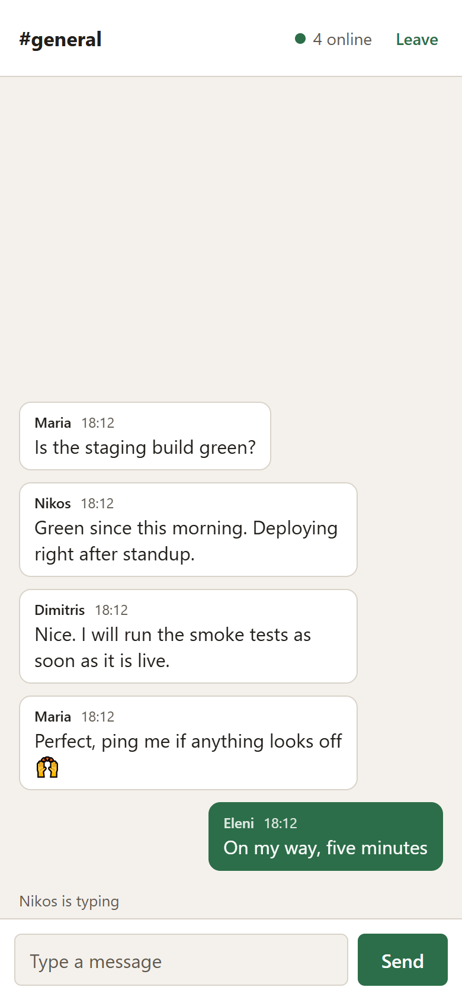
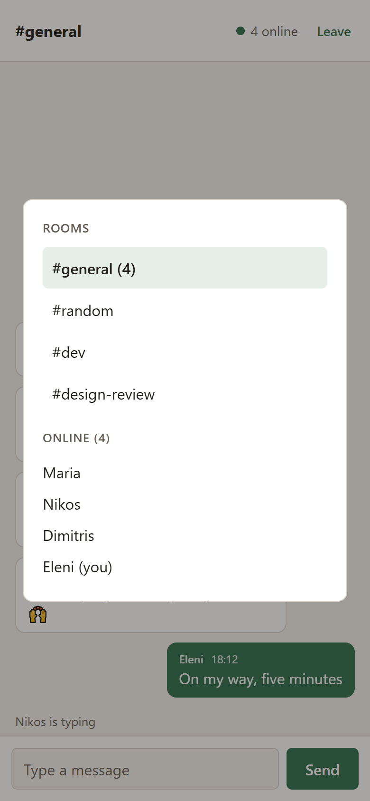

# Pigeon Mobile

React Native (Expo) app for [Pigeon](https://github.com/DimNt3000/pigeon), a
real-time chat server built with Node.js and Socket.IO. Same features as the
web client: join a room with a name,
real-time messages, room switching from the header modal, online list, typing
indicator, join and leave notices, automatic reconnect that replays missed
messages, and an outbox that holds anything you type while the connection is
down and sends it once you are back in the room.

<p>
  
  
</p>

**Android:** download the installable APK from the
[latest release](https://github.com/DimNt3000/pigeon-mobile/releases/latest).
It needs the [Pigeon server](https://github.com/DimNt3000/pigeon) running on
a computer on the same network.

## Stack

- Expo SDK 57, React Native 0.86, plain JavaScript
- socket.io-client 4 with `transports: ['websocket']` (no CORS setup needed on
  the server, and no long-polling quirks in React Native)
- react-native-safe-area-context for notch and gesture insets
- No Intl usage: timestamps are formatted manually because Hermes ships
  partial Intl support

## Getting started

1. Clone and start the chat server from the
   [pigeon](https://github.com/DimNt3000/pigeon) repo on your PC. It needs
   Node.js 24 or newer:

   ```
   git clone https://github.com/DimNt3000/pigeon.git
   cd pigeon
   npm install
   npm start
   ```

2. Clone this app, install it, start Metro, and scan the QR code with Expo Go.
   The phone and the PC need to be on the same WiFi:

   ```
   git clone https://github.com/DimNt3000/pigeon-mobile.git
   cd pigeon-mobile
   npm install
   npx expo start
   ```

3. In the app, set the server address on the join screen to your PC's address
   on the local network, for example `http://192.168.1.19:3000`. On Windows,
   `ipconfig` shows it as the IPv4 address. To change the default, edit
   `DEFAULT_SERVER_URL` in `src/config.js`.

## Installable Android app

The app can also be built into a standalone APK that installs like any other
app, with no Expo Go needed. It still talks to the same server on your PC.

```
npx expo prebuild --platform android
cd android
gradlew assembleRelease -PreactNativeArchitectures=arm64-v8a,x86_64
```

The APK lands in `android/app/build/outputs/apk/release/app-release.apk`. The
`android` folder is generated from `app.json` and is not committed; run
`prebuild` again after changing the config.

- Build with **JDK 17 or 21**. Newer JDKs print a native-access warning from
  the `prefab` tool that the Android Gradle plugin treats as a failure, so the
  C++ configure step fails with `WARNING: A restricted method in
  java.lang.System has been called`. Point `JAVA_HOME` at a 17 or 21 install.
- The architectures flag keeps the APK to 64-bit ARM phones and the x86_64
  emulator. Drop it to include every architecture.
- `app.json` enables cleartext traffic through `expo-build-properties`,
  because the server speaks plain `http://` on the local network. Release
  builds block that by default, and the app would never reach the server.
- The build is signed with the debug key, which is fine for installing on
  your own devices but not for a store.

## Testing in a desktop browser

The same code runs on the web through react-native-web:

```
npx expo start
```

Then open http://localhost:8081. On web the server address defaults to
`http://localhost:3000`.

## Troubleshooting

- "Could not reach the server": confirm the server is running, the phone is on
  the same WiFi, and the address matches the PC's current `ipconfig` IPv4.
- If the address is right and it still fails, Windows Firewall is probably
  blocking inbound connections to Node.js. Allow Node.js for private networks
  in Windows Security, then retry.
- Expo Go only runs projects on its own SDK version. If the project does not
  load, update the Expo Go app on the phone.

## Structure

```
App.js              Socket lifecycle, chat state, screen switching
src/config.js       Default server URL per platform
src/theme.js        Colors and fonts shared by both screens
src/JoinScreen.js   Name and server address form
src/ChatScreen.js   Inverted message list, typing line, composer, users modal
docs/               Screenshots for this README
```

## License

MIT
